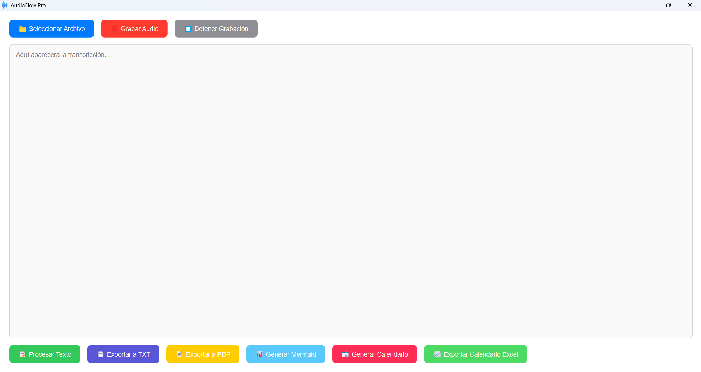

# 🎵 AudioFlow Pro

> **Transcribe, procesa y exporta audios a texto con facilidad.**

## 🖼️ Screenshot

<p align="center">
  
</p>

 

AudioFlow Pro es una aplicación de escritorio moderna para la transcripción de audio en español. Utiliza **OpenAI Whisper** para transcribir audios y proporciona herramientas avanzadas de exportación a **TXT, PDF, Excel** y **diagramas en Mermaid.js**.

## 🚀 Características Principales
- 🎤 **Grabación de audio en tiempo real**.
- 🎙 **Transcripción automática con OpenAI Whisper**.
- 📝 **Procesamiento inteligente de texto** (detección de instrucciones).
- 📄 **Exportación flexible** a TXT, PDF y Excel.
- 📊 **Generación de diagramas en Mermaid.js**.
- 📆 **Planificación de tareas SCRUM y calendarios**.
- 🌟 **Interfaz moderna y responsiva con PyQt6**.

---

## 📥 Instalación

### **1️⃣ Requisitos previos**
#### 🔹 **Python y dependencias**
Asegúrate de tener Python 3.8+ instalado y luego ejecuta:
```bash
pip install -r requirements.txt
```

#### 🔹 **FFmpeg (para conversión de audio)**
- **Windows**: Instala con Chocolatey → `choco install ffmpeg`
- **MacOS**: Instala con Homebrew → `brew install ffmpeg`
- **Linux**: Instala con APT → `sudo apt install ffmpeg`

#### 🔹 **Node.js y Mermaid CLI (para diagramas)**
```bash
npm install -g @mermaid-js/mermaid-cli
```

---

### **2️⃣ Clonar y ejecutar el proyecto**
```bash
git clone https://github.com/diegoaberrio/AudioFlow-Pro.git
cd audioflow-pro
python main.py
```

---

## 🖥 Capturas de Pantalla

| Inicio | Transcripción | Exportaciones |
|--------|--------------|---------------|
|  |  |  |

---

## 🛠 Tecnologías Utilizadas
### **🔹 Backend**
- **Python 3.8+**
- **OpenAI Whisper** (transcripción de audio)
- **FFmpeg** (procesamiento de audio)

### **🔹 Interfaz Gráfica**
- **PyQt6** (UI moderna y responsiva)

### **🔹 Grabación y Procesamiento de Audio**
- **sounddevice** (grabación en tiempo real)
- **numpy** + **scipy** (manipulación de audio)

### **🔹 Exportaciones**
- **FPDF** (archivos PDF)
- **openpyxl** (archivos Excel)
- **Mermaid CLI** (diagramas de flujo)

---

## 🛠 Funcionalidades Clave
### **1️⃣ Transcripción de Audio**
Convierte archivos de audio (`.mp3`, `.wav`, `.ogg`, `.m4a`) a texto automáticamente con OpenAI Whisper.

### **2️⃣ Grabación de Audio en Tiempo Real**
Permite grabar audio directamente desde la aplicación y transcribirlo instantáneamente.

### **3️⃣ Exportaciones Avanzadas**
| Formato | Descripción |
|---------|------------|
| 📄 **TXT** | Guarda el texto transcrito en un archivo plano. |
| 📝 **PDF** | Genera un PDF formateado con la transcripción. |
| 📈 **Excel** | Genera reportes organizados con resúmenes y gráficos. |
| 📊 **Mermaid.js** | Convierte texto en diagramas visuales. |
| 📆 **SCRUM y Calendario** | Distribuye tareas en sprints y días de planificación. |

---

## ⚙️ Configuración Avanzada
### **Modificar la tasa de muestreo de grabación**
En `recorder.py` puedes ajustar la calidad de la grabación:
```python
self.samplerate = 44100  # Cambia a 48000 para mayor calidad
```

### **Cambiar el idioma de la transcripción**
En `transcriptor.py`, ajusta el parámetro `--language`:
```python
comando = f'whisper "{archivo}" --language English --output_dir "{directorio}" --output_format txt'
```

---

## 🏆 Créditos y Autores
📌 Desarrollado por **Diego Alonso Berrío Gómez**  
🔗 GitHub: [Diego Aberrio](https://github.com/diegoaberrio)  
📩 Contacto: [diegoaberrio@hotmail.com](mailto:diegoaberrio@hotmail.com)

---

## 📜 Licencia
Este proyecto está bajo la licencia **MIT**. ¡Úsalo libremente y contribuye! 🚀

